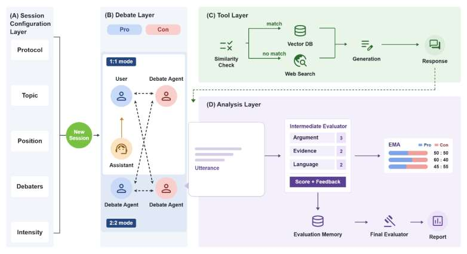
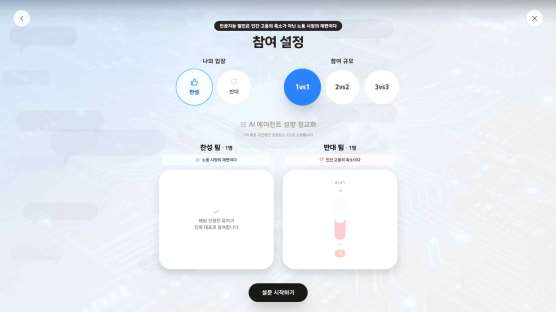
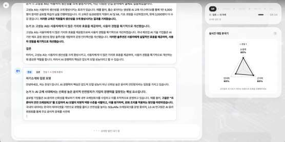
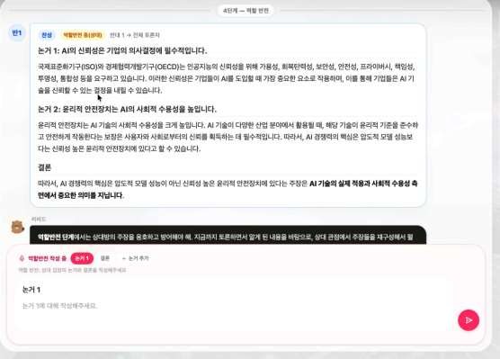
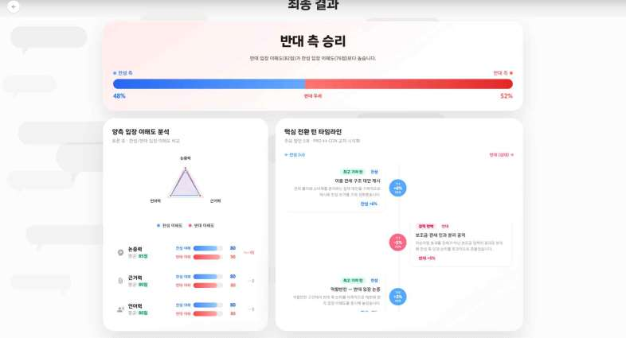
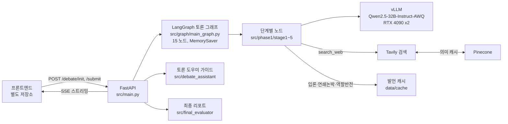
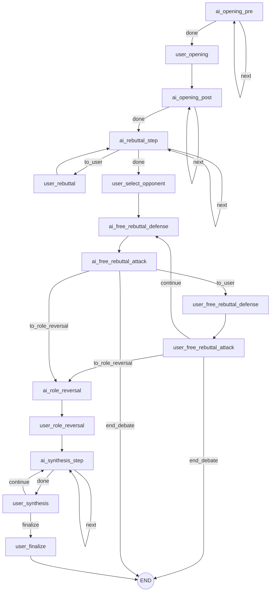
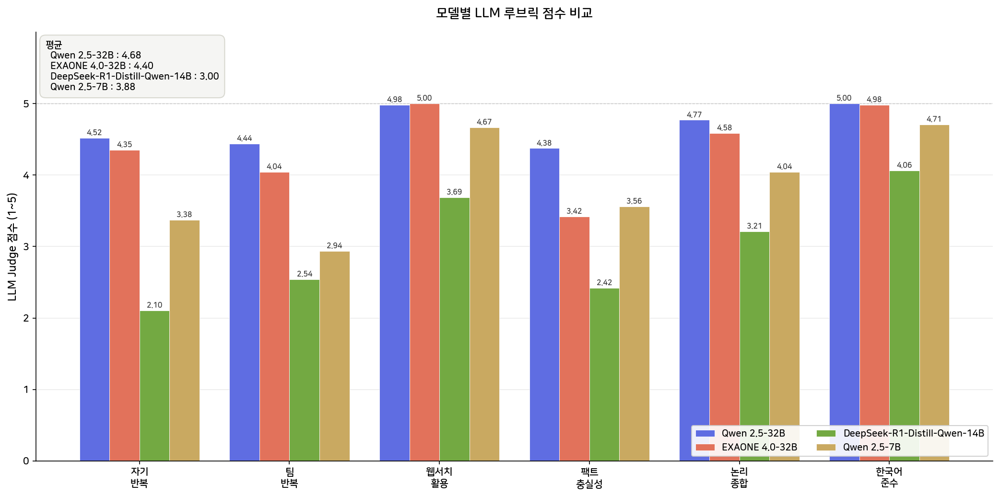

# SJU-Capstone-Multi-Agent-Debater-AI

세종대학교 Capstone Project 멀티 에이전트 토론 참여를 통한 문제 이해 지원 시스템 AI 파트 깃허브입니다.

찬성과 반대 진영에 사람 한 명과 AI 에이전트들이 나뉘어 들어가 논제 하나를 놓고 다툰다. 입론, 연쇄 논박, 자유 논박까지는 보통 토론과 같고, 구성적 논쟁 모드에서는 역할 반전과 종합 및 재개념화가 뒤에 붙는다. 에이전트는 연구실 GPU에 올린 Qwen2.5-32B-Instruct-AWQ가 말하고, 근거가 필요하면 웹을 검색해서 붙인다.

## 구조도



세션을 만들 때 방식(토론, 구성적 논쟁), 논제, 진영, 참여 규모(1:1, 2:2), 발언 강도를 고른다. 그 다음부터는 논쟁 레이어가 단계를 돌리고, 검색이 필요하면 도구 레이어가 벡터 DB를 먼저 뒤진 뒤 없을 때만 웹으로 나간다. 발언마다 분석 레이어가 점수를 매기고 마지막에 리포트로 묶는다. 도우미 비비드는 단계마다 무엇을 쓰면 되는지 알려주는 역할이고 대신 말해주지는 않는다.

화면 코드는 프론트엔드 저장소에 있다. 네 장면만 옮겨 둔다.

| 참여 설정 | 입론과 연쇄 논박 |
|---|---|
|  |  |
| 역할 반전과 도우미 비비드 | 최종 리포트 |
|  |  |

코드에서는 이렇게 이어진다.



토론 그래프는 아래처럼 생겼다. 사용자 차례가 오면 `interrupt`로 멈춰 있다가 프론트엔드에서 글이 오면 이어서 돈다.



## 결과

어떤 모델을 쓸지 정하려고 사용자 없이 AI끼리만 토론을 돌렸다. 12개 논제에 강경도 프리셋 4개를 곱해 모델당 48판이고, 채점은 LLM 심판이 8개 항목을 5점 만점으로 매긴 뒤 규칙 기반 형식 점수와 합쳐 평균냈다. 심판 모델과 항목 목록은 `experiments/config.py:144-161`, 점수 원본은 `artifacts/` 아래 CSV에 있다.

| 모델 | 형식 점수 | LLM 항목 평균 (5점) | 총점 (5점) | 승 / 무 / 패 |
|---|---|---|---|---|
| Qwen2.5-32B-Instruct-AWQ | 98.4 | 4.76 | 4.78 | 48 / 0 / 0 |
| Qwen2.5-7B-Instruct | 74.9 | 3.15 | 3.24 | 0 / 0 / 48 |

가장 벌어진 항목은 웹 검색 도구 사용(4.98 대 1.54)과 근거 충실성(4.38 대 1.77)이다. 7B는 도구 호출 형식을 자주 틀려서 검색 자체가 안 됐고, 그 자리를 지어낸 숫자로 채우는 일이 많았다.



## 내 역할

AI 파트를 맡았다. 2026년 3월 13일부터 5월 30일까지 develop에 커밋 422건.

- LangGraph 토론 그래프. 노드 15개와 조건부 엣지, `interrupt`로 사용자 차례 처리 (`src/graph/main_graph.py`)
- 입론부터 종합까지 단계별 노드와 프롬프트 (`src/phase1/stage1_opening` ~ `stage5_synthesis`)
- 진영·강경도별 에이전트 페르소나 생성 (`src/phase0/persona_factory.py`)
- 웹 검색 도구, Pinecone 의미 캐시, 재시도 래퍼 (`src/graph/llm.py`, `src/graph/vector_store.py`)
- 단계별 토론 도우미 가이드와 발언 캐시 (`src/debate_assistant`, `src/cache`, `scripts/cache`)
- FastAPI SSE 서버와 최종 리포트 (`src/main.py`, `src/final_evaluator`)
- vLLM 서빙 스크립트와 모델 비교 파이프라인 (`scripts/serve`, `experiments`, `scripts/benchmark`)

실시간 발언 평가(`src/live_analyzer`)와 사전·사후 이해도 평가(`src/evaluation`)는 팀원 담당이라 여기서는 다루지 않는다.

## 구조와 설계 결정

### 토론 그래프

처음에는 단계 하나를 노드 하나로 잡았는데, 그러면 2:2에서 에이전트 셋이 다 말할 때까지 화면에 아무것도 안 뜬다. 그래서 입론과 종합처럼 여러 명이 이어 말하는 단계도 한 명씩 도는 step 노드로 쪼갰다 (`src/graph/main_graph.py:596-613`). 노드가 끝날 때마다 state가 나오니 발언 하나가 끝나는 즉시 SSE로 밀어낼 수 있다.

사용자 차례는 노드 안에서 `interrupt`를 부르고 끝이다. 프론트엔드가 글을 보내면 `Command(resume=...)`로 같은 thread를 이어 간다 (`src/main.py:297`). 상태는 `MemorySaver`에만 있어서 API 프로세스를 내리면 진행 중인 세션도 같이 사라진다. 이 부분은 알고도 남겨 둔 제약이다.

어디로 갈지는 라우터 함수가 state를 보고 정한다 (`src/graph/main_graph.py:548-583`). 자유 논박은 사용자가 두 턴을 쓰면 끝나고, 토론 모드면 거기서 END로 빠진다. 구성적 논쟁 모드는 역할 반전을 거쳐 종합을 세 라운드 돌린 다음 사용자가 최적해를 쓴다.

### 모델과 서빙

7B도 후보였지만 위 표대로 검색을 못 쓰는 게 문제였다. 4-bit AWQ로 줄인 32B는 RTX 4090 두 장에 `--tensor-parallel-size 2`로 딱 들어간다 (`scripts/serve/start_vllm.sh:31-43`). 양자화 커널은 `awq`에서 `awq_marlin`으로 바꿔 3할 정도 빨라졌고, 시스템 프롬프트가 길고 세션 내내 같아서 프리픽스 캐싱도 켜 뒀다. 도구 호출 파서는 hermes.

생성 온도는 0.6에서 0.4로 내렸다 (`src/graph/llm.py:136`). 같은 입력을 넣어도 평가 점수가 매번 달라져서다. `max_tokens`는 2048로는 계획, 검색 결과, 본문이 한 번에 안 들어가 2560으로 늘렸다.

### 검색 캐시와 발언 캐시

검색을 매번 Tavily로 나가면 그만큼 턴이 느려진다. 그래서 `search_web`은 Pinecone에서 비슷한 질의를 먼저 찾고, 없을 때만 웹을 부른다 (`src/graph/llm.py:35-60`). 임베딩은 multilingual-e5-large, 저장은 URL 하나를 500자 청크로 나눠 넣고 꺼낼 때는 URL마다 제일 잘 맞는 청크 하나만 준다. 처음 채워 넣은 근거는 에이전트끼리 50판 돌리면서 모은 검색 결과와 논제별 배경지식이다. 재사용 기준은 코사인 유사도 0.86 (`src/graph/vector_store.py:76`). 질의 25개에 문서 94쌍을 직접 라벨링해서 Precision, Recall, F1을 보고 정한 값이고, `PINECONE_THRESHOLD`로 바꿀 수 있다. 한 세션 안에서 이미 쓴 URL은 다시 안 준다.

사용자 글과 상관없이 정해지는 발언은 아예 미리 만들어 둔다. AI 입론, AI끼리의 연쇄 논박, AI 역할 반전, 도우미 가이드가 여기 해당하고 논제·진영·강경도·초점별로 파일을 하나씩 둔다 (`src/cache/loader.py:5-9`). 캐시 파일은 git에 없다. `scripts/cache`의 스크립트로 만들면 되고, `SPEECH_CACHE_ENABLED=0`을 주면 캐시를 안 보고 매번 생성한다.

## 기술 스택

- Python, FastAPI, uvicorn, SSE
- LangGraph, langchain-openai
- vLLM, Qwen/Qwen2.5-32B-Instruct-AWQ
- Tavily 검색 API, Pinecone (REST 직접 호출)
- Streamlit (로컬 확인용 `src/streamlit_app.py`)
- matplotlib (`scripts/benchmark`)

```
src/
  main.py            FastAPI 엔드포인트, SSE
  graph/             LangGraph 그래프, LLM·검색 도구, Pinecone 캐시
  phase0/            에이전트 페르소나 생성
  phase1/stage1~5    단계별 노드
  debate_assistant/  사용자 안내 가이드
  cache/             발언 캐시 로더
  final_evaluator/   최종 리포트
experiments/         모델 비교 실험
scripts/             vLLM·API 실행, 캐시 생성, 차트
```

## 실행 방법

RTX 4090 두 장 기준이다. `scripts/serve/start_vllm.sh` 안의 conda 경로는 연구실 머신 기준이라 고쳐야 한다.

```bash
pip install -r requirements.txt
# .env 파일을 저장소 루트에 만든다
```

`.env`에 필요한 변수는 `LLM_MODEL`, `VLLM_BASE_URL`, `LLM_API_KEY`, `TAVILY_API_KEY`, `PINECONE_API_KEY`, `PINECONE_INDEX`다. 실시간 평가를 쓰면 `JUDGE_MODEL`, `JUDGE_VLLM_BASE_URL`도 넣는다.

```bash
bash scripts/serve/start_vllm.sh                  # vLLM, 8000번 포트
bash scripts/serve/start_api.sh                   # FastAPI, 8001번 포트
python scripts/cache/generate_opening_cache.py    # 발언 캐시 (선택)
python tests/run_full_fastapi_flow.py             # 전체 흐름 확인
```

모델 비교를 다시 돌리려면 실험용 vLLM을 8002번 포트에 따로 띄운다.

```bash
python -m experiments.generate --model Qwen-2.5-32B-Instruct
python scripts/benchmark/generate_benchmark_charts.py
```
