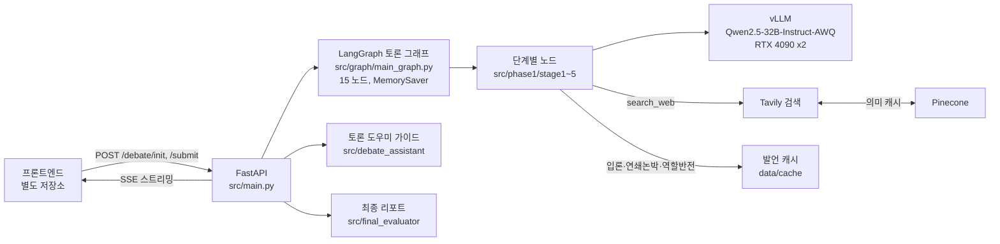
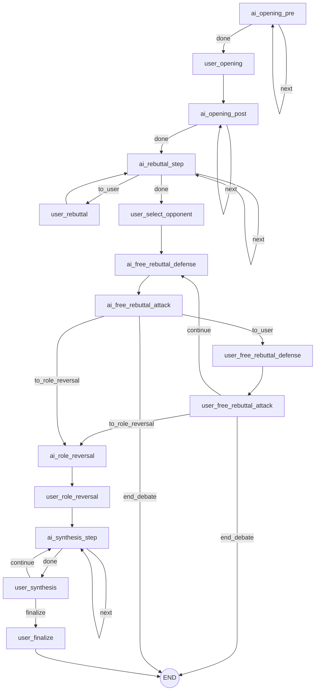

# SJU-Capstone-Multi-Agent-Debater-AI

세종대학교 Capstone Project 멀티 에이전트 토론 참여를 통한 문제 이해 지원 시스템 AI 파트 깃허브입니다.

사용자가 하나의 논제를 두고 AI 에이전트들과 입론, 연쇄 논박, 자유 논박, 역할 반전, 종합 및 재개념화의 5단계 논쟁을 진행한다. 구성적 논쟁(Johnson & Johnson)의 절차를 그대로 따르고, 일반 토론 모드는 자유 논박에서 끝난다. AI 에이전트는 로컬 vLLM 서버의 Qwen2.5-32B-Instruct-AWQ가 맡고, 필요하면 웹 검색으로 근거를 가져온다.

## 구조도


세션 생성, 논쟁, 도구, 분석의 네 레이어로 나뉜다. 세션 생성에서 방식(토론, 구성적 논쟁), 논제, 진영, 참여 규모(1:1, 2:2), 발언 강도를 정한다. 논쟁 레이어는 사용자와 에이전트가 진영을 이뤄 단계를 진행하고, 도우미 비비드가 단계별 안내를 붙인다. 도구 레이어는 검색 근거를 벡터 DB에서 먼저 찾고 없을 때만 웹을 검색한다. 분석 레이어는 발언마다 점수를 매겨 최종 리포트를 만든다.

화면은 프론트엔드 저장소에 있고, 여기서는 네 단계만 보인다.

| 참여 설정 | 입론과 연쇄 논박 |
|---|---|
|  |  |
| 역할 반전과 도우미 비비드 | 최종 리포트 |
|  |  |

코드 기준의 연결은 아래와 같다.



토론 그래프의 노드와 분기는 아래와 같다. 사용자 차례는 `interrupt`로 멈추고, 프론트엔드가 보낸 입력으로 재개한다.



## 결과

같은 48개 토론(12개 논제 × 4개 강경도 프리셋, 사용자 없이 전원 AI)을 두 모델로 돌리고 LLM 심판이 채점했다. 심판 모델과 8개 채점 항목은 `experiments/config.py:144-161`에 있다. 총점은 규칙 기반 형식 점수 1개와 LLM 항목 8개의 평균이다. 원본은 `artifacts/results_summary.csv`, `artifacts/win_rate_table.csv`.

| 모델 | 형식 점수 | LLM 항목 평균 (5점) | 총점 (5점) | 승 / 무 / 패 |
|---|---|---|---|---|
| Qwen2.5-32B-Instruct-AWQ | 98.4 | 4.76 | 4.78 | 48 / 0 / 0 |
| Qwen2.5-7B-Instruct | 74.9 | 3.15 | 3.24 | 0 / 0 / 48 |

항목별로 차이가 가장 큰 곳은 웹 검색 도구 사용(4.98 대 1.54)과 근거 충실성(4.38 대 1.77)이다. 32B는 검색 결과를 발언에 붙이지만 7B는 도구 호출 자체를 자주 놓쳤다.


## 내 역할

박신지. develop 브랜치 커밋 기준 2026-03-13부터 2026-05-30까지 422건.

- LangGraph 토론 그래프 설계와 구현. 15개 노드, 조건부 엣지, `interrupt` 기반 사용자 차례 (`src/graph/main_graph.py`)
- 입론부터 종합까지 5단계 노드와 프롬프트 (`src/phase1/stage1_opening` ~ `stage5_synthesis`)
- 진영·강경도별 에이전트 페르소나 생성 (`src/phase0/persona_factory.py`)
- 웹 검색 도구, Pinecone 의미 캐시, 재시도 래퍼 (`src/graph/llm.py`, `src/graph/vector_store.py`)
- 단계별 토론 도우미 가이드와 발언 캐시 (`src/debate_assistant`, `src/cache`, `scripts/cache`)
- FastAPI SSE 서버와 최종 리포트 (`src/main.py`, `src/final_evaluator`)
- vLLM 서빙 스크립트와 모델 비교 파이프라인 (`scripts/serve`, `experiments`, `scripts/benchmark`)

실시간 발언 평가(`src/live_analyzer`)와 사전·사후 이해도 평가(`src/evaluation`)는 팀원이 맡았다.

## 구조와 설계 결정

### 발화 하나가 노드 하나

입론과 종합처럼 AI 여러 명이 연달아 말하는 단계도 에이전트 한 명씩 도는 step 노드로 나눴다 (`src/graph/main_graph.py:596-613`). 그래프를 `stream_mode="values"`로 돌리면 노드가 끝날 때마다 state가 나오므로, 발언 하나가 끝나는 즉시 SSE로 보낼 수 있다 (`src/main.py:240`). 단계를 노드 하나로 묶으면 에이전트 세 명 발언이 모두 끝나야 화면에 나온다.

사용자 차례는 노드 안에서 `interrupt`를 호출해 멈춘다 (`src/graph/main_graph.py:179, 263, 308, 356, 391, 427, 501, 525`). 프론트엔드가 `/debate/{session_id}/submit`으로 입력을 보내면 `Command(resume=...)`로 같은 thread를 이어 간다 (`src/main.py:297`). 상태는 `MemorySaver`에 두므로 세션 하나가 API 프로세스 하나에 묶인다 (`src/graph/main_graph.py:675-676`).

분기는 라우터 함수가 state를 보고 정한다 (`src/graph/main_graph.py:548-583`). 자유 논박은 사용자가 2턴을 마치면 끝나고, 토론 모드면 역할 반전과 종합을 건너뛰고 END로 간다 (`:548-559`). 구성적 논쟁 모드는 역할 반전을 거쳐 종합을 3라운드 돌린 뒤 사용자가 최적해를 쓴다 (`:576-583`).

### 32B AWQ를 GPU 2장에 텐서 병렬로

7B는 형식은 맞추지만 검색 도구를 잘 쓰지 못했고 근거 없는 수치를 만들었다. 위 표의 웹 검색 도구 사용과 근거 충실성 항목이 그 차이다. 그래서 4-bit AWQ로 양자화한 32B를 RTX 4090 2장에 `--tensor-parallel-size 2`로 올렸다 (`scripts/serve/start_vllm.sh:31-43`). 커널은 `awq_marlin`, 프리픽스 캐싱과 hermes 도구 호출 파서를 켰다. 시스템 프롬프트가 길고 세션 안에서 반복되므로 프리픽스 캐싱 효과가 크다.

생성 온도는 0.6에서 0.4로 내렸다 (`src/graph/llm.py:136`). 같은 입력에서 평가 점수가 흔들리는 폭을 줄이기 위해서다. `max_tokens`는 계획, 검색 결과, 본문이 한 응답에 들어가도록 2560으로 뒀다 (`:137`).

### 검색 결과와 발언을 캐시해 대기 시간 줄이기

`search_web`은 Tavily를 부르기 전에 Pinecone에서 같은 뜻의 질의를 먼저 찾는다 (`src/graph/llm.py:35-60`). 임베딩은 multilingual-e5-large이고, 저장할 때는 URL 하나를 500자 청크로 나눠 넣고, 조회 때는 URL별 최고 점수 청크 하나만 돌려준다 (`src/graph/vector_store.py:1-9`). 초기 근거는 에이전트끼리 자동으로 돌린 논쟁 50회에서 모은 자료와 논제별 배경지식으로 채웠다. 재사용 임계값은 코사인 유사도 0.86이다 (`src/graph/vector_store.py:76`). 질의 25건, 질의–문서 94쌍에 정답을 달고 Precision, Recall, F1을 비교해 골랐다. 임계값은 `PINECONE_THRESHOLD`로 바꿀 수 있다. 한 세션에서 이미 쓴 URL은 제외해 같은 근거가 반복되지 않게 한다.

사용자 입력과 무관한 AI 발언은 미리 만들어 둔다. AI 입론, AI끼리의 연쇄 논박, AI 역할 반전, 도우미 가이드가 대상이고 논제·진영·강경도·초점별로 파일을 둔다 (`src/cache/loader.py:5-9`). 캐시는 git에 넣지 않고 `scripts/cache`의 생성 스크립트로 만든다. `SPEECH_CACHE_ENABLED=0`이면 캐시를 끄고 매번 생성한다.

## 기술 스택

- Python, FastAPI, uvicorn, SSE
- LangGraph, langchain-openai
- vLLM, Qwen/Qwen2.5-32B-Instruct-AWQ
- Tavily 검색 API, Pinecone (REST 직접 호출)
- Streamlit (로컬 확인용 `src/streamlit_app.py`)
- matplotlib (`scripts/benchmark`)

```
src/
  main.py            FastAPI 엔드포인트, SSE
  graph/             LangGraph 그래프, LLM·검색 도구, Pinecone 캐시
  phase0/            에이전트 페르소나 생성
  phase1/stage1~5    단계별 노드
  debate_assistant/  사용자 안내 가이드
  cache/             발언 캐시 로더
  final_evaluator/   최종 리포트
experiments/         모델 비교 실험
scripts/             vLLM·API 실행, 캐시 생성, 차트
```

## 실행 방법

RTX 4090 2장 기준이다. `scripts/serve/start_vllm.sh`의 conda 경로는 자기 환경에 맞게 고친다.

```bash
pip install -r requirements.txt
# .env 파일을 저장소 루트에 만든다
```

`.env`에 필요한 변수는 `LLM_MODEL`, `VLLM_BASE_URL`, `LLM_API_KEY`, `TAVILY_API_KEY`, `PINECONE_API_KEY`, `PINECONE_INDEX`다. 실시간 평가를 쓰면 `JUDGE_MODEL`, `JUDGE_VLLM_BASE_URL`도 넣는다.

```bash
bash scripts/serve/start_vllm.sh                  # vLLM, 8000번 포트
bash scripts/serve/start_api.sh                   # FastAPI, 8001번 포트
python scripts/cache/generate_opening_cache.py    # 발언 캐시 (선택)
python tests/run_full_fastapi_flow.py             # 전체 흐름 확인
```

모델 비교 실험은 실험용 vLLM을 8002번 포트에 따로 띄운다.

```bash
python -m experiments.generate --model Qwen-2.5-32B-Instruct
python scripts/benchmark/generate_benchmark_charts.py
```
